<p align="center">
  
</p>

<h1 align="center">Drift</h1>

<p align="center">
  <strong>The free desktop editor that makes your videos look finished — not “good enough.”</strong>
</p>

<p align="center">
  <a href="https://github.com/CutWire-Studios/Drift/releases/latest"></a>
  <a href="LICENSE"></a>
  
</p>

<p align="center">
  <a href="https://github.com/CutWire-Studios/Drift">GitHub</a> ·
  <a href="https://github.com/CutWire-Studios/Drift/releases/latest">Download</a> ·
  <a href="https://github.com/CutWire-Studios/Drift/issues">Issues</a> ·
  <a href="LICENSE">License</a>
</p>

Drift is a desktop video editor from CutWire Studios. Drop in clips, add effects, captions, stickers,
and music, then export a polished video — with **no subscription, no watermark, and no account**.

It is built for the edits people actually make: Reels and Shorts, game clips, school projects,
tutorials, product demos, memes, and anything you want to look sharp without living in a browser
or paying a monthly fee.

What you see in the preview is what you export. One compositor, one look, no surprises.

## Download

<p align="center">
  <a href="https://flathub.org/apps/org.cutwire.Drift">
    
  </a>
</p>

**Linux** — install from Flathub:

```bash
flatpak install flathub org.cutwire.Drift
flatpak run org.cutwire.Drift
```

Or grab a build for your platform from the
[latest release](https://github.com/CutWire-Studios/Drift/releases/latest):

| Platform | Package |
|----------|---------|
| Linux | [Flathub](https://flathub.org/apps/org.cutwire.Drift) · [AppImage](https://github.com/CutWire-Studios/Drift/releases/latest) |
| Windows | [Installer (.exe)](https://github.com/CutWire-Studios/Drift/releases/latest) · [Portable zip](https://github.com/CutWire-Studios/Drift/releases/latest) |
| macOS | [Disk image (.dmg, Apple Silicon)](https://github.com/CutWire-Studios/Drift/releases/latest) |
| Android | [APK (arm64-v8a)](https://github.com/CutWire-Studios/Drift/releases/latest) · [APK (armeabi-v7a)](https://github.com/CutWire-Studios/Drift/releases/latest) · [APK (x86_64)](https://github.com/CutWire-Studios/Drift/releases/latest) |

On a phone, grab `Drift-*-arm64-v8a.apk` from the latest release and install it (or `adb install Drift-*-arm64-v8a.apk`). Use `x86_64` for emulators.

See [all releases](https://github.com/CutWire-Studios/Drift/releases) for previous versions and full changelogs.

## Screenshots

<p align="center">
  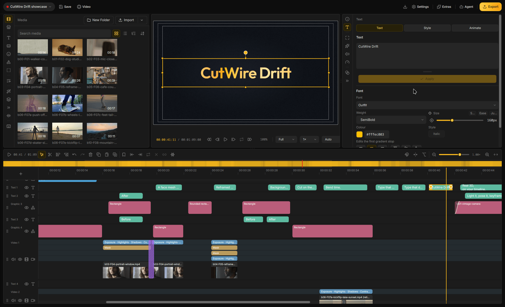
</p>

<p align="center"><em>Everything in one window — media, preview, inspector, and timeline</em></p>

<p align="center">
  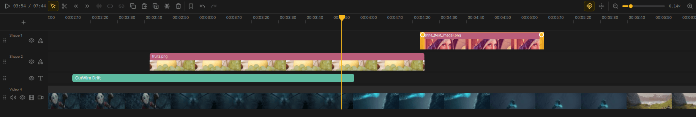
</p>

<p align="center"><em>A real multi-track timeline, with overlays, titles, and filmstrip thumbnails</em></p>

<table>
  <tr>
    <td width="50%" align="center">
      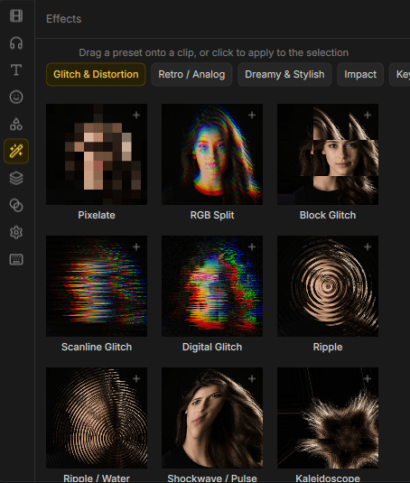<br>
      <strong>Effects that sell the look</strong><br>
      Every preset is previewed on a real frame
    </td>
    <td width="50%" align="center">
      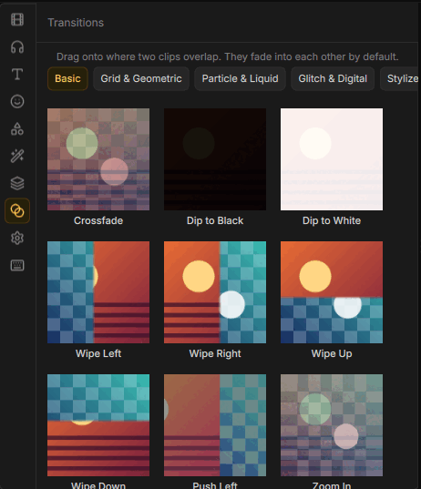<br>
      <strong>Transitions that feel expensive</strong><br>
      Drop one where two clips overlap
    </td>
  </tr>
  <tr>
    <td width="50%" align="center">
      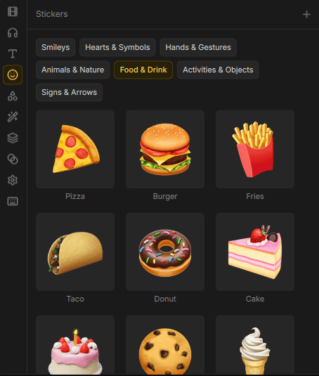<br>
      <strong>Stickers and emoji on demand</strong><br>
      Search, drag, and drop them onto the canvas
    </td>
    <td width="50%" align="center">
      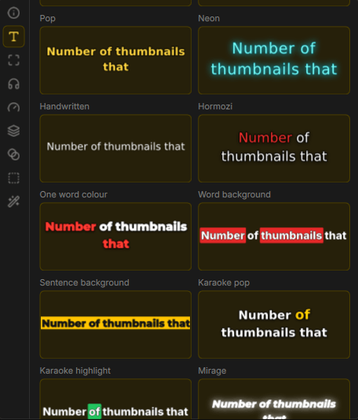<br>
      <strong>Titles that actually get watched</strong><br>
      Neon, karaoke, highlights, and punchy word styles
    </td>
  </tr>
  <tr>
    <td width="50%" align="center">
      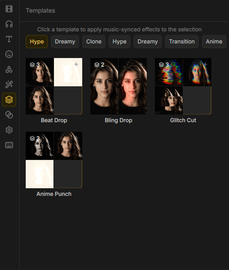<br>
      <strong>Look templates in one click</strong><br>
      Music-synced stacks like Beat Drop and Glitch Cut
    </td>
    <td width="50%" align="center">
      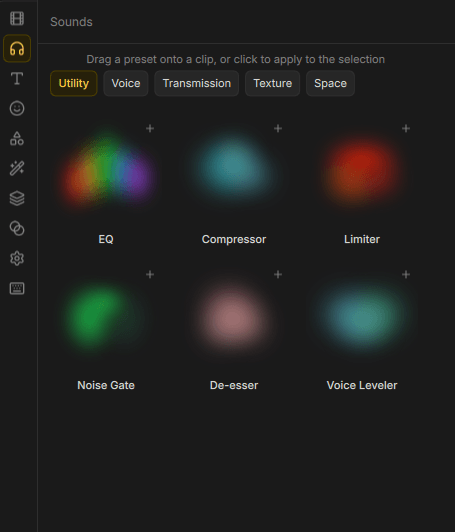<br>
      <strong>Audio that sounds intentional</strong><br>
      EQ, compressor, gate, de-esser, and voice tools
    </td>
  </tr>
  <tr>
    <td width="50%" align="center">
      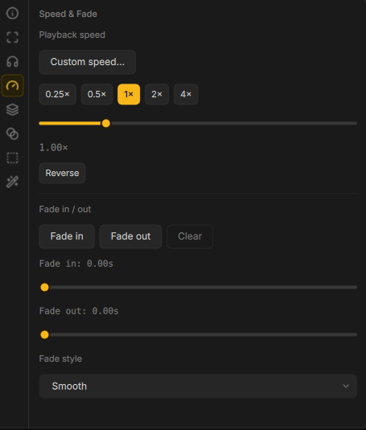<br>
      <strong>Speed, reverse, and fades</strong><br>
      Slow-mo, ramps, reverse, and clean in/out
    </td>
    <td width="50%" align="center">
      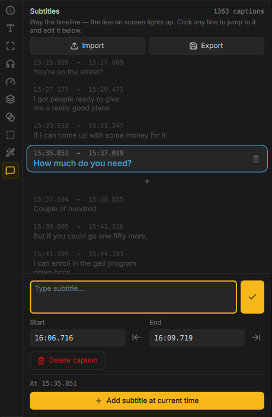<br>
      <strong>Captions from the speech itself</strong><br>
      Generate them, then edit every line
    </td>
  </tr>
  <tr>
    <td width="50%" align="center">
      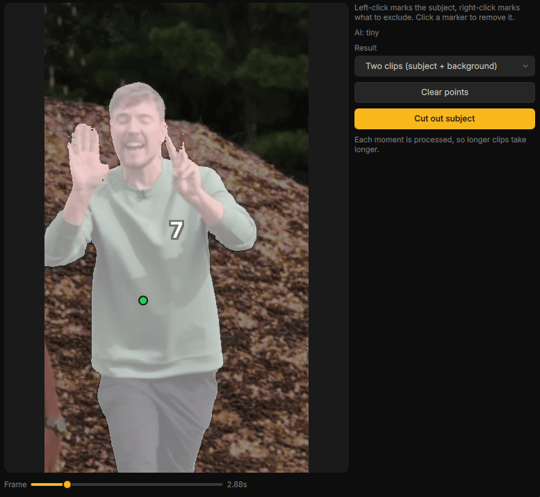<br>
      <strong>Click the subject. Keep only that.</strong><br>
      Isolate a person or object onto its own clip
    </td>
    <td width="50%" align="center">
      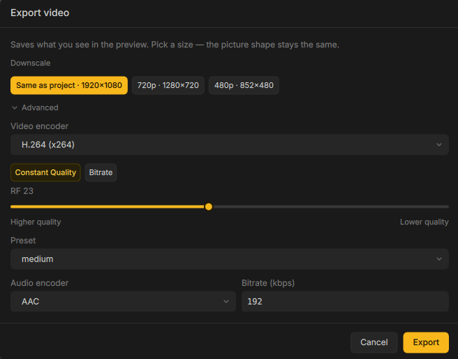<br>
      <strong>Export that matches the preview</strong><br>
      Simple presets up front, extra control when you want it
    </td>
  </tr>
</table>

## Features that actually ship in the edit

**A timeline that behaves like a real editor.** Trim, split, snap, ripple, mute or hide tracks, and
undo anything. Stack overlays, titles, and B-roll instead of fighting a one-track toy.

**Looks in seconds, not hours.** GPU effects, stylish transitions, and reusable look templates — so
a clip can go from raw footage to a finished vibe without opening another app.

**Text, stickers, emoji, and shapes on the canvas.** Neon titles, karaoke-style captions, reaction
stickers, and callouts stay in the same editor as the cut.

**Auto captions you can actually fix.** Speech becomes timed subtitle lines. Edit the wording, tweak
the timing, and export with captions that match how people watch on mute.

**Cutouts, masks, and green screen.** Click a subject and lift it onto its own clip. Mask parts of a
shot, or key out a green screen when you need a cleaner composite.

**Motion that hits the beat.** Speed ramps, reverse, fades, and edits that snap to the music — the
kind of pacing that makes a clip feel designed, not dumped.

**Audio tools that clean up the mix.** Volume, fades, EQ, compression, noise cleanup, and voice
effects, so narration and music sit together instead of fighting.

**Multicam when one camera is not enough.** Watch every angle at once, punch between cameras, and
save the take as a clean cut — without rebuilding the timeline by hand.

**Project bundles for sharing and backup.** Package a project with its media so the whole edit moves
with you, instead of breaking the moment a file path changes.

**Export that looks like the preview.** MP4 with quality presets, GIF loops, and ranged export from
an In/Out work area. What you signed off on is what you get.

## Agent access — let an AI edit with you

Drift has a built-in **MCP server** for local AI tools. Turn on Agent access and Cursor, Claude Code,
or another compatible agent can work in the open project: import media, place and trim clips, change
effects, capture a still of the composition, and export.

This is a real editor hook, not a chatbot bolted onto a webpage. The agent sees the timeline and can
make edits you can undo.

Agent access stays **off until you enable it**, and it only listens on your own computer. Full setup
and safety notes live in the [MCP guide](docs/MCP.md).

## Addons, without bloating the install

Fonts, stickers, extra effects, and speech models download inside Drift when you need them. Keep the
app light, then grab only the packs that match the video you are making.

Open the Addon Manager from the header, or follow the install prompt when a feature needs a pack.

## Why people pick Drift

Most “free” editors want an account, a watermark, or a subscription the moment the video starts
looking good. Drift is the opposite: **yours, on your computer, GPLv3, no login wall.**

It is fast enough for a 30-second social cut and deep enough for a real project — captions, effects,
audio, cutouts, multicam, and an AI-assisted timeline if you want one.

## Help us translate Drift

[](https://hosted.weblate.org/engage/cutwire-drift/)

## For developers

Build, packaging, architecture, and agent protocol live in `docs/`:

- [Building, testing, packaging, and architecture](docs/BUILDING.md)
- [GPU effects](docs/gpu-effects.md)
- [GPU transitions](docs/gpu-transitions.md)
- [Time Echo architecture](docs/time-echo-architecture.md)
- [Agent access / MCP](docs/MCP.md)

## Help and feedback

Found a bug or have an idea? Open an
[issue on GitHub](https://github.com/CutWire-Studios/Drift/issues).

## License

GPLv3 — see [LICENSE](LICENSE).

## Star History

<a href="https://www.star-history.com/?repos=CutWire-Studios%2FDrift&type=date&legend=top-left">
 <picture>
   <source media="(prefers-color-scheme: dark)" srcset="https://api.star-history.com/chart?repos=CutWire-Studios/Drift&type=date&theme=dark&legend=top-left&sealed_token=zHW_d2jon9Wn-HYP2SWQWLC7qDRaY7qwsvHS0Cp0Ywk1Rf1UvyxhWsakIrx2c11OijPJQ9o52W99jdigV7MOz5RuvLsyWQmBiMvMdk99mcfbgb591WtzNXQO8_K2YhgdbiPD9by00lwl69ZgCZnThFKBwhRbK7IQzIeFkIFnb2o0r5GhJh0HAX6Q8yTM" />
   <source media="(prefers-color-scheme: light)" srcset="https://api.star-history.com/chart?repos=CutWire-Studios/Drift&type=date&legend=top-left&sealed_token=zHW_d2jon9Wn-HYP2SWQWLC7qDRaY7qwsvHS0Cp0Ywk1Rf1UvyxhWsakIrx2c11OijPJQ9o52W99jdigV7MOz5RuvLsyWQmBiMvMdk99mcfbgb591WtzNXQO8_K2YhgdbiPD9by00lwl69ZgCZnThFKBwhRbK7IQzIeFkIFnb2o0r5GhJh0HAX6Q8yTM" />
   
 </picture>
</a>
